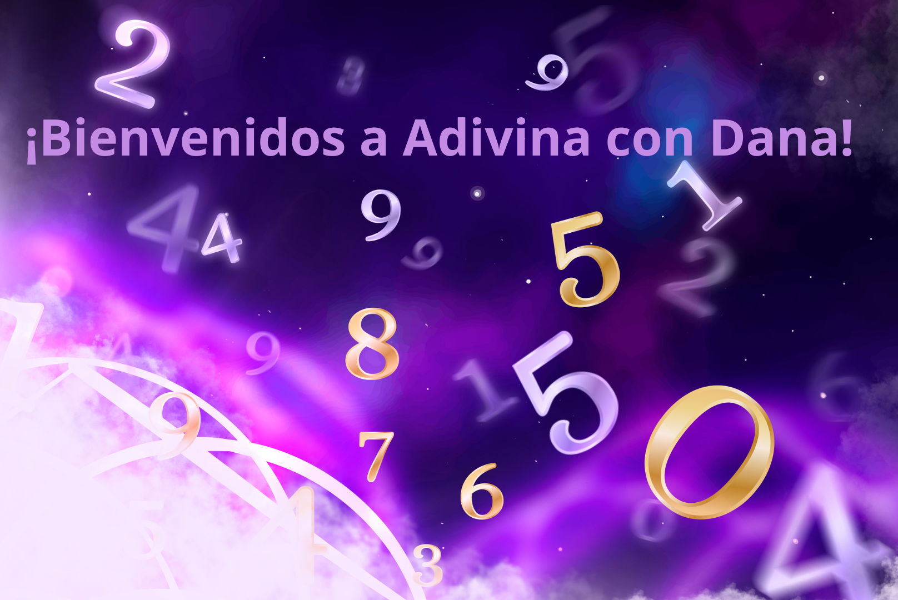
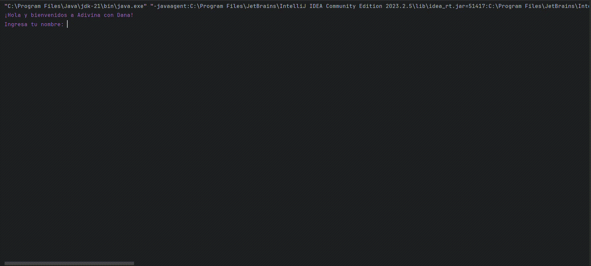
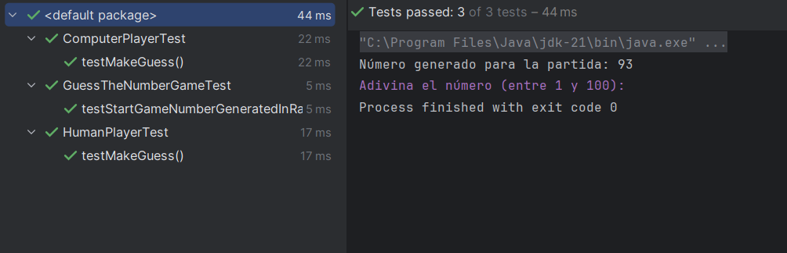
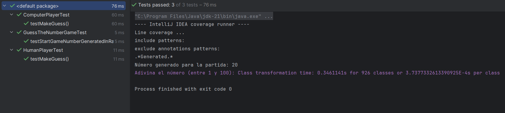
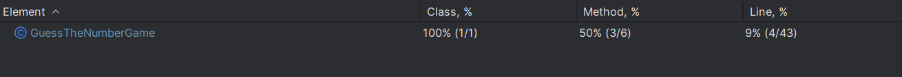

# ¡Bienvenido a Adivina con Dana! - Guess the Number

## Índice

- [1. Preámbulo](#1-preámbulo)
- [2. Resumen del Proyecto](#2-resumen-del-proyecto)
- [3. Demo](#3-demo)
- [4. Consideraciones Generales](#4-consideraciones-generales)
- [5. Tecnologías utilizadas](#5-tecnologías-utilizadas)
- [6. Testing](#6-testing)
---

## 1. Preámbulo

En este emocionante juego, te sumergirás en un desafío de habilidad mental donde tendrás que poner a prueba tu capacidad de adivinación.

## 2. Resumen del Proyecto

Es un juego interactivo que se desarrolla en el terminal, primero te dará la bienvenida al juego, luego te pedirá que ingreses tu nombre y enseguida te saludará y te dirá que comencemos el juego. Te dará una breve explicación de como jugar y luego pedirá que ingreses tu suposición. 
Las reglas del juego son: 
- Se generará un número aleatorio entre 1 y 100 al comienzo de cada partida.
- Tendrás un máximo de 5 intentos para adivinar el número secreto.
- Después de cada intento, se te darán pistas sobre si tu suposición es demasiado alta o baja.
- Si logras adivinar el número, serás declarado el ganador. ¡Peso si no lo haces, el juego se reiniciará y te preguntará si quieres jugar otra vez!
- Ten en cuenta que estás jugando en contra de la computadora y ella también hace sus suposiciones.

¡Que comience la aventura de Adivina con Dana!

## 3. Demo

## 4. Consideraciones Generales

### Diagrama de Clases

#### `GuessTheNumberGame`

**Propósito:**
Maneja la lógica principal, decide qué jugador asume el próximo turno.

**Atributos:**

- `random`: Generador de números aleatorios.
- `targetNumber`: Número aleatorio entre 1 y 100 a adivinar en la partida actual.

**Métodos estáticos (`static`):**

- `main(String[] args)`: Inicia el juego y genera el número aleatorio.
- `checkGuess(Player player)`: Ejecuta un turno, obtiene la suposición
  y evalúa el nuevo estado de la partida.

#### `Player`

**Propósito:**
Representa a una jugadora genérica. Es una clase abstracta.
Define los atributos y métodos que todas las _clases_ de jugadoras deben compartir:

**Atributos:**

- `name`: El nombre de la jugadora.
- `guesses`: El historial de suposiciones de la jugadora.

**Métodos:**

- `makeGuess()`: Devuelve la suposición de la jugadora. Es un método abstracto.
- `getName()`: Devuelve el nombre de la jugadora.
- `getGuesses()`: Devuelve el historial de suposiciones de la jugadora.

#### `HumanPlayer` y `ComputerPlayer` (heredan de `Player`)

**Propósito:**
Representa a las jugadoras _Humana_ y _Computadora_, respectivamente.

**Métodos:**

- `makeGuess()`: Método que cada clase que hereda de `Player` debe implementar.

**Relaciones:**

- La clase `GuessTheNumberGame` interactúa con las clases `HumanPlayer`
  y `ComputerPlayer` para gestionar el juego.
- Tanto la clase `HumanPlayer` como `Computer Player` son subclases de `Player`,
  lo que implica que heredan todas sus propiedades y métodos,
  pero también tienen algunas características adicionales propias.

Este diseño de clases permite separar las responsabilidades,
facilitando el mantenimiento y posibles extensiones del juego en el futuro.

Por ejemplo, podríamos añadir diferentes jugadoras "máquina" con diferentes
estrategias para la suposición automática, un nuevo tipo de
jugadora "remota" o incluso diferentes niveles de dificultad.

## 5. Tecnologías utilizadas

- Java: es un lenguaje de programación de propósito general, orientado a objetos y diseñado para ser altamente portable.
- JUnit Jupiter:es parte del framework de pruebas unitarias JUnit 5 para Java.
- GitHub: La utilidad de esta tecnología era almacenar el repositorio y facilitar el trabajo.
- Git: soporte de control de versiones proporcionado.

## 6. Testing

